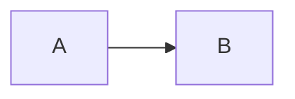

# <Concept>

> Explain it in two sentences, no jargon.

## Problem it solves
What goes wrong without it.

## How it works

## When to use / when not to
| Use when | Avoid when |
|---|---|

## Trade-offs
-

## Real systems that use it
-

## Seen in
- [[ ]]
