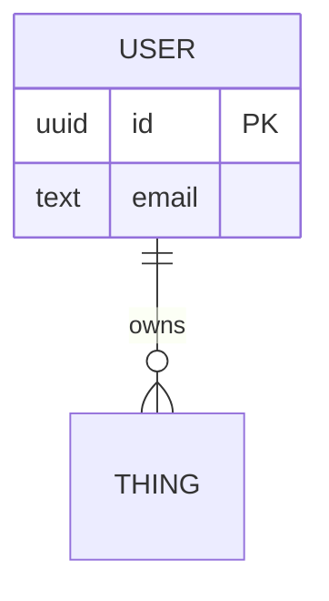
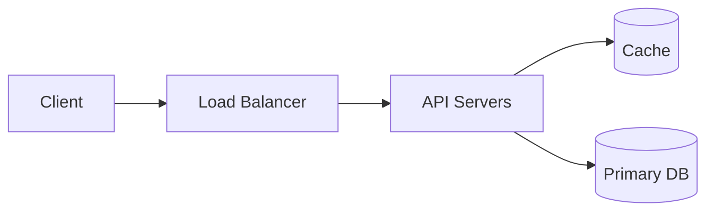
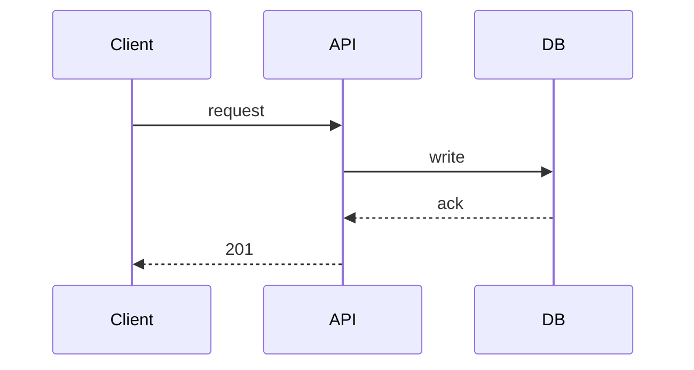

# NNN — <System Name>

> One-line: what this system does and for whom.

## 1. Requirements

**Functional**
-

**Non-functional**
- Scale:
- Latency:
- Availability / consistency target:

**Explicitly out of scope**
-

## 2. Back-of-envelope

| Quantity | Estimate | Working |
|---|---|---|
| DAU | | |
| QPS (avg / peak) | | |
| Storage / yr | | |
| Bandwidth | | |

## 3. API

```
POST /resource
GET  /resource/{id}
```

## 4. Data model



Store choice + why:

## 5. High-level design



## 6. Deep dives
<!-- the 2-3 places this design is actually interesting -->

###



## 7. Bottlenecks & scaling

| Bottleneck | Symptom | Fix | Cost |
|---|---|---|---|

## 8. Trade-offs made
<!-- what you chose, what you gave up. this section is the whole point -->
-

## 9. Failure modes
- What breaks when X dies:
- Recovery:

## Concepts used
- [[ ]]

## Implementation
- Repo:
- Commit:
- What I actually got working vs. skipped:

## Open questions
-
